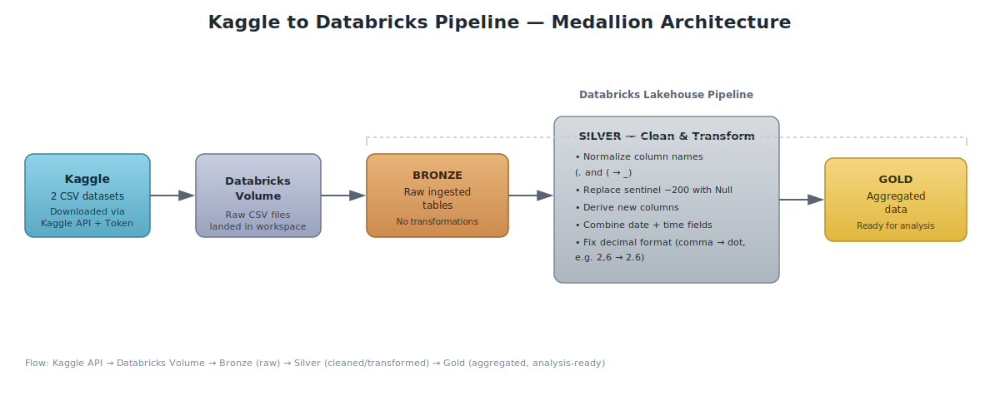

# Databricks: Process Files from Kaggle

This project downloads datasets from Kaggle (via the Kaggle API) into a Databricks volume, then cleans, transforms, and aggregates the data through a medallion architecture (Bronze → Silver → Gold) for downstream analysis.

## Overview

Two CSV datasets are pulled from Kaggle directly into Databricks, ingested as-is into the Bronze layer, cleaned and standardized in the Silver layer, and finally aggregated into the Gold layer for analysis.

## Architecture

## Pipeline Steps

### 1. Load data into Databricks via Kaggle API

1. Log in to your Kaggle account and generate an API token.
2. Create a volume in the Databricks workspace to store the downloaded files.
3. Use the Kaggle API to import the CSV files into the volume.

### 2. Ingest into Bronze layer

Raw CSV files are loaded into Bronze tables without any transformations, preserving the original source data.

### 3. Clean and transform in Silver layer

The following transformations are applied to produce clean, analysis-ready records:

- **Normalize column names** — special characters such as `.` and `(` are replaced with `_`.
- **Handle sentinel values** — occurrences of `-200` are replaced with `Null`.
- **Derive new columns** — additional fields are computed from existing data.
- **Combine date and time** — separate date and time columns are merged into a single timestamp value.
- **Fix decimal formatting** — columns using a comma as the decimal separator (e.g. `2,6`) are converted to standard dot notation (e.g. `2.6`).

### 4. Aggregate into Gold layer

Cleaned Silver data is aggregated and loaded into the Gold layer, ready for reporting and further analysis.

## Tech Stack

- **Kaggle API** — dataset download and authentication
- **Databricks** — volume storage, orchestration, and compute
- **PySpark / SQL** — cleaning, transformation, and aggregation logic

## Getting Started

1. Generate a Kaggle API token from your Kaggle account settings.
2. Create a Databricks volume to store the downloaded datasets.
3. Run the ingestion notebook/job to pull data from Kaggle into the volume.
4. Run the pipeline to process data through Bronze → Silver → Gold layers.
5. Query the Gold layer tables for cleaned, aggregated data.
